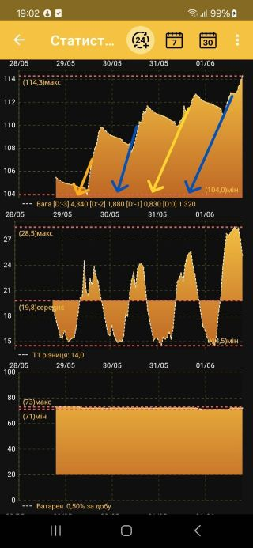
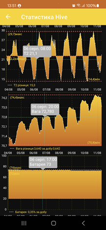
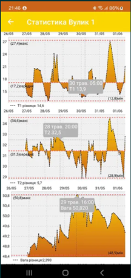
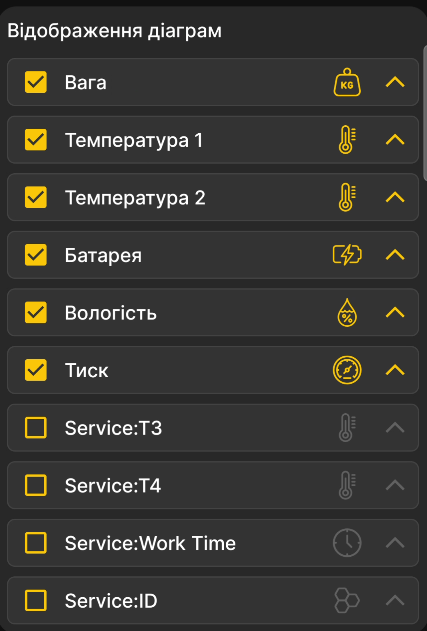

Youtube інструкція тут: (https://www.youtube.com/watch?v=a2y94tJWnhs)

Actual version: 3.1.50c6afa9ae(2025-05-29)
   - додані додаткові розрахунки денного приросту ваги під графіком    

 

<!---

 -->

## Philosophy
 The device and software "BeeApiary" is intended for the creation of permanent care for vital activity of a bee family (hive) or an apiary in general. The system collects information about weight hive, temperature inside and outside, humidity, pressure, etc. Collected information helps the beekeeper to monitor the various stages of the development of the family, to make analyzes and forecasts. 
> [!TIP] 
> ### In the summer 
> this way you can see the overhang of collected honey or prevent unwanted swarming.
> [!TIP]
> ### In winter
> the change in the weight of the hive shows whether additional food is needed. The humidity indicators allow keep the family healthy.

> [!IMPORTANT]
> **Maximum attention was paid to**
> battery life,
> traffic minimization.

It is also worth adding that the device does not collect personal and technical information and does not transfer it to third parties.

### Planed works:
 - Add actions(Events) as a chart element on native Android version

### Tested on:
 - Samsung A13(A135U1), Android 13 (API 33)
 - Samsung S22(S901B), Android 13 (API 33) 
 - Samsung S24(S921B), Android 14 (API 34)
   
### Useful project links:
 - Information about device and firmware [here](https://github.com/Ivan-Bdgilko/Hive_Controller)
 - General user manual UKR (18 pages) [here](https://github.com/Ivan-Bdgilko/Apiary_Docs/blob/main/Manual%20User.pdf)
 - Foreground mode for Android app [here](https://express.ms/faq/background-work-fix)

Actual version: 3.1.3b9dbaa6b5(2025-05-09)
 - додані дінамічні періоди перегляду (клікабелні іконки періодів)
    
     
 - збереження налаштувань графіків
 
  
